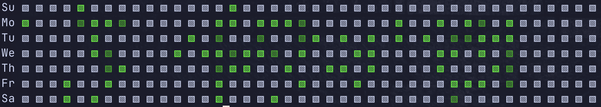

# git-heatmap

Shows a heatmap for your Git repositories.



## Install

```
$ pip install git-heatmap
```

## Usage

```
Usage: git-heatmap [OPTIONS]

Options:
  -r, --repo TEXT       Path to git repository (can be relative)
  -a, --author TEXT     Author email (default all authors)
  -b, --branch TEXT     Branch (default all branches)
  -s, --start TEXT      Start date (YYYY-MM-DD, defaults to current year
                        start)
  -e, --end TEXT        End date (YYYY-MM-DD, defaults to current year end)
  -c, --character TEXT  Character to use for heatmap (defaults to ▧)
  -sh, --shade TEXT     Color to use for heatmap (defaults to 0;255;0)
  --help                Show this message and exit.
```

##  Examples

Run `git-heatmap` ...

```
# in a directory that's already a git repository
$ git-heatmap

# on a repository elsewhere
$ git-heatmap -r /path/to/repo

# limit by author email
$ git-heatmap -a me@myself.com

# pick a specific branch
$ git-heatmap -b main

# pick multiple branches
$ git-heatmap -b main -b develop

# start from date
$ git-heatmap -s 2023-02-01

# end on date
$ git-heatmap -s 2023-02-28

# change characters
$ git-heatmap -c '●'

# change colors
$ git-heatmap -sh "255;255;0"
```

## FAQ

### Why?

Mostly fun, I like things cli. It's also rather annoying that github's heatmap only targets the _primary_ branch of a repository.

### Does this count any contribution other than commits?

No, this is purely commits, including merge commits (I think! :-))

### What branch does it pick if I didn't specify one?

All branches!

### But commits are the same in more than one branch!

Yes, that's why it only counts unique commit hashes.

### Where's the damn month row on top?

I got lazy, please submit a PR. The code already calculates where the month abbreviation should be, someone just needs to implement it (See comments)

### This will be slow on large repositories!

Yes, more than likely. I'm using `gitpython` and didn't really dig much into the documentation. The date and author filters are in python, not delegated to git. If you have the solution, please submit PR.

### Why not make this a git extension?

That was the original plan, but we are where we are...

### Can I...

Yes you can. Remember this is meant as tiny fun project.
