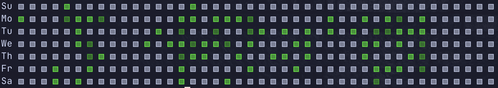
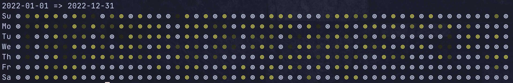

# git-heatmap

Shows a heatmap for your Git repositories.



## Install

```
$ pip install git-heatmap
```

## Usage

```
Usage: git-heatmap [OPTIONS]

Options:
  -r, --repo TEXT       Path to git repository (can be relative)
  -a, --author TEXT     Author email (default all authors)
  -b, --branch TEXT     Branch (default all branches)
  -s, --start TEXT      Start date (YYYY-MM-DD, defaults to current year
                        start)
  -e, --end TEXT        End date (YYYY-MM-DD, defaults to current year end)
  -c, --character TEXT  Character to use for heatmap (defaults to ▧)
  -sh, --shade TEXT     Color to use for heatmap (defaults to 0;255;0)
  --help                Show this message and exit.
```

##  Examples

Run `git-heatmap` ...

```bash
# in a directory that's already a git repository
$ git-heatmap

# on a repository elsewhere
$ git-heatmap -r /path/to/repo

# on multiple repositories!
$ git-heatmap -r /path/to/repo -r /path/to/other

# limit by author email
$ git-heatmap -a me@myself.com

# limit by multiple authors email
$ git-heatmap -a me@myself.com -a him@himself.com

# pick a specific branch
$ git-heatmap -b main

# pick multiple branches
$ git-heatmap -b main -b develop

# start from date
$ git-heatmap -s 2023-02-01

# end on date
$ git-heatmap -e 2023-02-28
```

How about some character and color change as well?



You can do this via:

```bash
# change characters
$ git-heatmap -c '⊚'

# change colors
$ git-heatmap -sh "255;255;0"
```


## FAQ

### Why?

Mostly fun, I like things cli. It's also rather annoying that github's heatmap only targets the _primary_ branch of a repository.

### Does this count any contribution other than commits?

No, this is purely commits, including merge commits (I think! :-))

### What branch does it pick if I didn't specify one?

All branches!

### But commits are the same in more than one branch!

Yes, that's why it only counts unique commit hashes.

### The months labels aren't in line with the github heatmap

Github got it wrong, check any month's start date and notice how they push the label one column further. If you still feel they got it right, create an issue and show a screenshot, I'll fix it.

### This will be slow on large repositories!

No, this internally uses `git-rev-list`. 

### Why not make this a git extension?

That was the original plan, but we are where we are...

### Can I...

Yes you can. Remember this is meant as tiny fun project.
